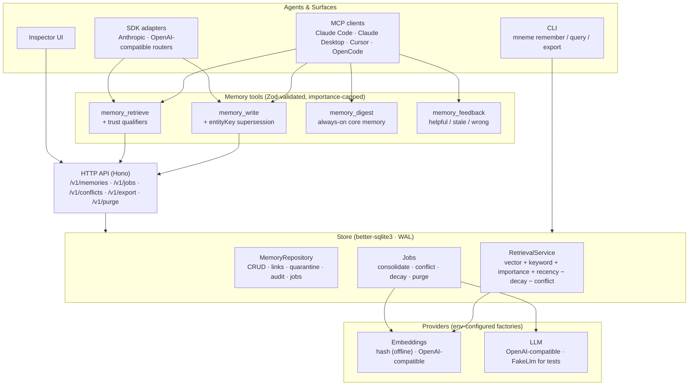

# Mneme — Personal AI Memory OS

[](https://github.com/Danialsamadi/memory-os/actions/workflows/ci.yml)
[](LICENSE)


> Chat history is a log. Mneme is a brain.

Mneme is a **local-first personal memory operating system** that gives AI agents durable, typed long-term memory. It extracts semantic facts from episodic conversations, anchors single-current-value facts to entity keys so new values supersede old ones, detects and resolves conflicts, decays stale information, and retrieves with a hybrid scoring pipeline that attaches trust qualifiers and learns from agent feedback — all on local SQLite with full user control over export and purge. An always-on digest covers what retrieval can't: the facts an agent should just know at session start.

## Architecture



The MCP server talks to the store directly (like the CLI); the SDK adapters route through the HTTP API. All write paths share the same guards.

## Monorepo layout

```
apps/
  api/             HTTP API (Hono) + inspector page
  demo-agent/      tool-calling demo agent
  mcp-server/      stdio MCP server (Claude Code/Desktop/Cursor)
packages/
  core/            Zod schemas, scoring helpers, ID generation
  store/           SQLite repository, retrieval, jobs
  embeddings/      provider interface + hash/OpenAI embeddings
  sdk/             MnemeClient + tool definitions + provider adapters
  evals/           32 golden cases + lifecycle test
  cli/             mneme CLI
scripts/
  demo.sh          north-star demo script
```

## Retrieval scoring

Hybrid score per candidate memory:

```
score = 0.40·vector + 0.20·keyword + 0.15·importance
      + 0.10·recency - 0.10·decay - 0.05·conflict
```

Weights defined in `DEFAULT_RANK_WEIGHTS` (`packages/core/src/scoring.ts`). Retrieval is 100% non-LLM; the LLM is used only in consolidation and conflict detection.

Retrieval also closes the loop instead of being a one-way pipe:

- **Trust qualifiers** — each result may carry a `qualifier` string ("stored 8 months ago — may be outdated; disputed by a conflicting memory; low confidence") so the consuming LLM can hedge instead of confidently asserting stale facts.
- **Touch-on-retrieve** — returned memories get their `lastAccessedAt` bumped, so memories that keep proving relevant rank higher over time via the recency term.

## Memory tools (MCP)

| Tool | What it does |
|------|--------------|
| `memory_write` | Store a typed memory (episodic / semantic / procedural). Pass `entityKey` (e.g. `user.employer`) for single-current-value facts — a new value automatically supersedes the old one instead of coexisting with it. |
| `memory_retrieve` | Hybrid-scored recall with trust qualifiers on each result. |
| `memory_digest` | Always-on core memory: pinned + most important facts as one capped block. Call once at session start — the "agent should just know this" layer that pure retrieval misses. |
| `memory_feedback` | Report a retrieved memory as `helpful`, `stale`, or `wrong`. Helpful raises confidence (and re-activates a disputed memory); stale/wrong lowers it and marks the memory disputed, hiding it from default retrieval. |

**Entity anchoring** fixes the classic staleness bug ("I work at Acme Corp" retrieved three months after you switched jobs): facts with an `entityKey` behave like a current-value slot, not an append-only log. The consolidation job emits entity keys too, so facts extracted from conversation get the same treatment. Superseded values stay in history (`status: superseded`, linked via `supersedes`) — nothing is silently lost.

## Quick start

```bash
pnpm install
pnpm test                              # all tests
pnpm eval                              # eval harness (32 cases)
pnpm dev:api                           # http://localhost:8787

# CLI
pnpm --filter @mneme/cli start remember semantic "User prefers TypeScript"
pnpm --filter @mneme/cli start query "TypeScript preference"
pnpm --filter @mneme/cli start export

# Inspector
open http://localhost:8787/inspector

# North-star demo (requires API running)
./scripts/demo.sh
```

## Use from any AI agent

Mneme exposes `memory_write`, `memory_retrieve`, `memory_digest`, and `memory_feedback` over MCP. Any MCP-capable agent can use it — verified live with Claude Code (write in one session, recall in a fresh one).

**Claude Code:**

```bash
claude mcp add --scope user mneme -- pnpm --dir /path/to/memory-os mcp
```

Then verify inside a new session with `/mcp` — mneme must show as connected. Tool calls appear as permission prompts named `mneme - memory_write` / `mneme - memory_retrieve`.

**Claude Desktop** — add to `~/Library/Application Support/Claude/claude_desktop_config.json` (macOS) or `%APPDATA%\Claude\claude_desktop_config.json` (Windows), then restart the app:

```json
{
  "mcpServers": {
    "mneme": {
      "command": "pnpm",
      "args": ["--dir", "/path/to/memory-os", "mcp"]
    }
  }
}
```

**Cursor** — Settings → MCP → Add server, or add the same `mcpServers` block to `~/.cursor/mcp.json`.

**OpenCode:**

```bash
opencode mcp add mneme -- pnpm --dir /path/to/memory-os mcp
```

**Any other MCP client** — it's a standard stdio server: command `pnpm`, args `["--dir", "/path/to/memory-os", "mcp"]`.

The server stores to `~/.mneme/mneme.db` by default; set `MNEME_DB` in the server's `env` to share one database with the API/CLI/Inspector.

**Testing tips (learned the hard way):**
- Confirm the tool is actually connected in the session before judging results (`/mcp` in Claude Code, `opencode mcp list`).
- Hosts with their own memory feature (Claude Code) may prefer it for passive "remember X" phrasing — name the tool ("use the mneme memory_write tool") or add `Use the mneme MCP tools for storing and recalling user memories.` to your `CLAUDE.md` / agent rules.
- Independent proof a write landed: `sqlite3 ~/.mneme/mneme.db "SELECT type, content FROM memories WHERE status='active'"`.

**Anthropic / OpenAI / any OpenAI-compatible router** (OpenRouter, Groq, Ollama, Mistral):

```ts
import { toAnthropicTools, toOpenAiTools, parseToolCall, executeMemoryTool, MnemeClient } from "@mneme/sdk";

const client = new MnemeClient({ baseUrl: "http://localhost:8787" });
// pass toAnthropicTools() to the Messages API, or toOpenAiTools() to Chat Completions
// on any tool call the model returns:
const { name, args } = parseToolCall(providerToolCall);
const result = await executeMemoryTool(client, name, args);
```

Every provider path shares the same guards: Zod validation on all inputs and agent-write importance capped at 0.8 (prompt-injection protection).

## Evals

| Metric | Value |
|--------|-------|
| Golden cases | 32 |
| Precision@5 | 0.984 |
| Stale-fact rate | 0.000 |
| Pass rate | 0.969 |

Lifecycle tests prove the full pipeline: episode → extraction → conflict detection (or `entityKey` supersession) → retrieval excludes the stale fact.

Behavioral evals go beyond retrieval ranking and test outcomes — the failure modes most memory systems never measure: does an entity update actually replace the old fact at retrieval time, does stale feedback demote a memory out of default retrieval and out of the digest, do disputed results carry a warning qualifier, does repeated feedback converge confidence instead of oscillating.

## Privacy

- **Export:** `GET /v1/export` — full JSON dump of all non-deleted memories
- **Purge:** `POST /v1/purge` — hard-deletes rows, embeddings, and links
- **Auth:** set `MNEME_TOKEN` env var to require Bearer auth on all `/v1/*` routes
- **Audit:** export and purge actions are logged to the audit table

## 2-minute reviewer script

```bash
pnpm install && pnpm test && pnpm eval
pnpm dev:api &
sleep 1

# Write and retrieve
curl -s -X POST http://localhost:8787/v1/memories \
  -H 'Content-Type: application/json' \
  -d '{"type":"semantic","content":"User lives in Vancouver","tags":["location"]}'

curl -s -X POST http://localhost:8787/v1/memories/retrieve \
  -H 'Content-Type: application/json' \
  -d '{"query":"Where do I live?","limit":3}' | python3 -m json.tool

# Inspector
open http://localhost:8787/inspector

# Export
curl -s http://localhost:8787/v1/export | python3 -m json.tool
```

## License

MIT — see [LICENSE](LICENSE).
