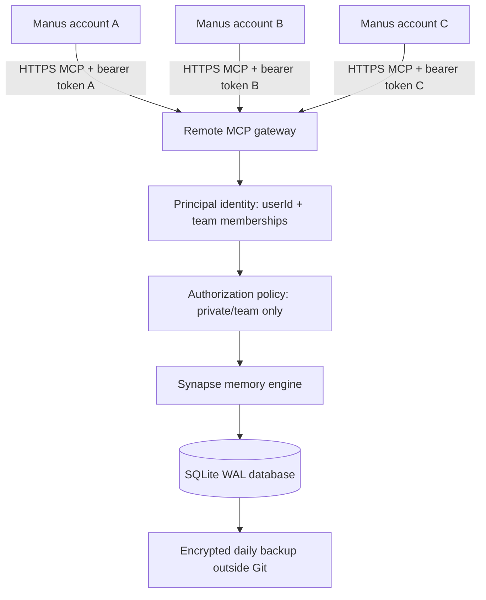

# Synapse Central Memory Architecture Audit

## Status

This document records the audit of the upstream Synapse repository at commit `b8c3316` and the secure target architecture for use by multiple Manus accounts. The upstream implementation is **not production-ready for shared multi-tenant Internet exposure without the changes listed below**.

## Verified current architecture

Synapse is a TypeScript monorepo. The principal components are:

| Component | Current implementation |
|---|---|
| Memory engine | `packages/store`, backed by SQLite and `better-sqlite3` |
| Data model | Memories contain `userId`, but no first-class `scope`, `ownerId`, or `teamId` |
| Retrieval | Hybrid vector/FTS5/BM25/importance/recency/decay pipeline |
| Local MCP | `apps/mcp-server`, stdio transport only; all MCP calls use `userId: "local"` |
| HTTP API | `apps/api`, Hono server exposing `/v1/*` routes and Inspector UI |
| Authentication | One optional global `SYNAPSE_TOKEN`; when unset, all `/v1/*` routes are unauthenticated |
| Database concurrency | SQLite WAL and 5-second busy timeout are already enabled |
| Backup | SQLite online-backup support and CLI backup/restore exist |
| Session digest | `memory_digest` exists, but the agent must choose to call it |

## Security findings

1. **The HTTP API is not a multi-tenant authorization boundary.** The client can submit `userId` in request bodies and query strings. Several routes accept an arbitrary memory ID without checking that it belongs to the authenticated principal.
2. **The current token is global, not principal-bound.** `SYNAPSE_TOKEN` authenticates the server as a whole and does not map credentials to a user or team.
3. **The current data model cannot represent team sharing safely.** `userId` alone cannot express private, team, and intentionally global visibility with an enforceable membership relation.
4. **The current MCP server is local stdio only.** It opens the SQLite database directly and hard-codes `userId: "local"`; it is not a remote HTTPS MCP endpoint.
5. **The API exposes operational and destructive routes under the same broad `/v1/*` authentication gate.** A production gateway must apply per-principal authorization and preferably restrict administrative routes to an operator credential.
6. **Forced recall is not provided by MCP itself.** Tool descriptions can strongly instruct the model, but an MCP server cannot guarantee that Manus calls `memory_digest` before a session. A Manus-level instruction/skill or a wrapper that performs the first call is required.

## Secure target architecture



The gateway must derive identity **only from the credential**, never from an untrusted `userId`, `ownerId`, `teamId`, or `scope` supplied by an MCP caller. Every read, write, update, delete, feedback, link, export, digest, and retrieval operation must apply the same policy before touching the repository.

## Required schema and policy

Each memory should have:

| Field | Meaning |
|---|---|
| `scope` | `private` or `team`; do not enable `global` unless explicitly required |
| `ownerId` | Principal that created/owns a private memory |
| `teamId` | Team namespace for team memories |
| `createdBy` | Authenticated principal that performed the write |

The authorization predicate should be equivalent to:

```text
private: ownerId == authenticated.userId
team:    teamId is in authenticated.teamIds
```

The server must ignore or reject caller-supplied identity fields that conflict with the authenticated principal. Retrieval candidate queries must include the predicate before ranking, not filter results after retrieval. Object-ID endpoints must return `404` for an object outside the caller's visibility to avoid existence disclosure.

## Remote MCP transport

Use the official MCP TypeScript SDK Streamable HTTP transport behind Hono or a small Node HTTP adapter. Expose one HTTPS endpoint such as `/mcp`. Authenticate the HTTP request before creating or dispatching an MCP session. Reject missing, malformed, and invalid bearer credentials with `401`; do not log credential values or memory content. Manus's current Custom MCP documentation supports an HTTPS server URL and API key/Bearer authentication.

The endpoint must be fronted by TLS termination, secure headers, request-size limits, rate limiting, and a reverse proxy or managed HTTPS host. SQLite must remain private to the process and must never be exposed as a public file or HTTP route.

## Forced recall workaround

MCP tool availability alone cannot force Manus to call a tool. Use a Manus instruction/skill that says to call `memory_digest` at the beginning of every new session and to use `memory_retrieve` before answering questions about stored facts. If deterministic enforcement is required, add a gateway/client wrapper that performs the digest call and injects the result into the first model request; this is outside the MCP protocol itself.

## Deployment decision

The current session has no VPS, fixed server, domain, DNS control, or user-supplied deployment credentials. Therefore no public deployment was performed. A local test server in the ephemeral sandbox would not satisfy the requirement for an Internet-accessible always-on MCP endpoint.

## Verification requirements before production

- Unit tests for credential-to-principal mapping and constant-time token comparison.
- Unit and integration tests for private isolation, same-team sharing, and outside-team denial.
- Tests proving that forged `userId`, `ownerId`, `teamId`, and `scope` arguments cannot broaden access.
- MCP over HTTPS handshake and tool-list tests using two distinct credentials.
- Rate-limit, malformed-input, missing-auth, and generic-error tests.
- Backup/restore test against a live WAL database.
- TLS and reverse-proxy configuration verification.

## Audit evidence

The upstream baseline passed `pnpm typecheck` and `pnpm test` at commit `b8c3316`. Those tests validate the existing single-user/local behavior; they do not prove multi-tenant isolation.

## References

- [Manus Custom MCP Servers](https://manus.im/docs/integrations/custom-mcp)
- [Synapse repository](https://github.com/Danialsamadi/synapse)
- [MCP TypeScript SDK](https://github.com/modelcontextprotocol/typescript-sdk)

> Do not connect this upstream branch to a public Manus Custom MCP URL until the authorization and remote transport work is implemented and tested.

